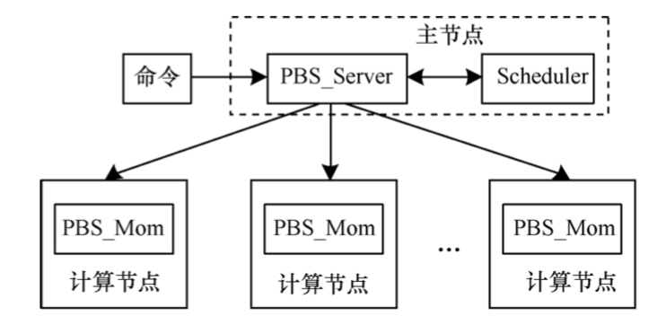

# 1. 静态审计简介

静态审计是对Lustre文件存储的元数据进行详尽审计，摆脱数据库的黑盒状态。

传统的文件系统管理工具(Robinhood)通过实时遍历文件目录树获取文件元数据信息，以实现管理监视功能。 但对于大规模文件系统，元数据信息的获取需要耗费大量时间，传统管理工具无法适应当前大规模文件存储的审计需求。

而一旦元数据规模扩大时，MySQL存储速度会下降，并且MySQL存储能力有限，在TB数据级时会发生显著地读写性能下降，成为静态分析的速度瓶颈。

# 2. Poda工具

为了对集群数据进行更快的静态审计，在调研了作业管理系统和最新分布式数据库的基础上，分层存储小组计划开发一款内部Poda工具。

该Poda工具将会集成了Robinhood策略引擎、Torque作业管理系统和TiDB这一兼容MySQL的无限水平扩展、强一致与高可用的新型数据库。

该Poda工具会通过分布式并行计算获取文件系统元数据信息，并将信息保存到TiDB数据库，同时给予数据库中的元数据信息，实现文件系统的监视、管理与审计功能。

基于调研结果表明，采用分布式并行计算能够充分利用集群的计算资源，提高文件系统的遍历速率；而采用TiDB的方式来存储遍历得到的元数据信息，则可以进一步加速元数据的存储速度，并能够适应大规模机器的。两个改进方法后，文件系统的监视、管理与静态审计可以更快地进行。

以下将分别介绍：
- Robinhood策略引擎
- Torque作业管理系统
- TiDB数据库
  
# 3. Robinhood策略引擎

对于文件数量众多，管理需求复杂的大型文件系统，单纯使用Linux命令进行文件管理，效率会非常低下。

而开源的Robinhood是一款非常优秀的文件系统管理软件，它通过遍历文件系统目录树收集元数据信息，将收集道德元数据信息保存到数据库。通过统计分析数据库中存储的文件信息，实现文件系统的管理与监视功能。Robinhood的架构如图所示：


信息采集器的功能是收集文件系统的元数据信息。它运用多线程技术,深度优先遍历文件系统。在Linux操作系统中,单个目录下文件的数量没有限制,如果广度优先会有内存溢出风险; 但是Linux系统对文件目录树的最大深度做了规定,一般不超过256,所以,采用深度优先遍历可以规避这个问题。

文件清单管理器实现了对MySQL数据库的基本操作,比如查询、插入、删除、更新等。它接受来自信息采集器、资源监视器和基于Web监视模块的服务请求,提供数据服务。

资源监视器根据用户提供的“ 清理策略” 配置条 件,通过文件清单管理器查询数据库进行匹配。 在“ 清理策略” 中, 以文件的过期时间、文件归属等信息 为条件, 实现对文件系统的自动管理。例如,管理员可以设定将文件最后更新时间在2000年以前且属于用户Jack的文件删除。

基于Web的监视模块调用文件清单管理器提供的数据库访问接口,对数据库中文件元数据信息进行分析统计后生成图形报表,并以Web网页形式展示。

由于数据库保存文件系统的元数据信息存在一定的滞后性,如果信息过于滞后,将无法正确有效地管理文件系统。 Robinhood的架构只能运行于单台计算机,单台计算机的有限的计算能力,制约了Robinhood的快速遍历文件树的性能,无法保证数据库信息及时更新。 经过测试,Robinhood 遍历一次大 型文件系统需要耗费数天时间,比如,对于一个拥有一千七百多万文件数量的文件系统,一次遍历需要耗时31h。这使得数据库中存储的文件元数据信息过于滞后而无法使用。

# 4. Torque作业管理系统

Torque作业管理系统架构如下图所示：



Torque作业管理系统包含一个主节点(Head Node)和多个计算节点(Compute Node)。 在主节点上运行着PBS_Server进程,而在计算节点上运行PBS_Mom进程。 客户端的命令(Command)可以安装到任意节点上(包括没有运行PBS_Server或者PBS_Mom的节点)。


# 5. 改进型Robinhood

为了解决单台计算机遍历文件系统的性能瓶颈,本文根据分布式计算的要求对Robinhood进行改进,下文简称为改进型Robinhood:


上图展示了本文工具的拓扑结构,各个节点通过网络相互连接。 在每个计算节点上部署了改进的Robinhood,它根据目录切分算法实现了文件系统目录树的自动切分,并将符合条件的目录树以作业的形式向PBS_Server提交,从而实现了对文件系统的多任务并行遍历。

切分算法如下图所示：


# Robinhood数据库源码解析

在内部并没有做tiering，有个外部工具叫做Robinhood Policy Engine。

robinhood通过读取lustre的changlog文件，把元数据访问信息导入自己的数据区。

有了元数据的统计信息，可以设置一定的策略，将一些长期未使用的老文件从lustre迁移到外部的归档设备上。

robinhood也知道lustre内部的一些信息，例如OST aware。


# Robinhood安装命令

## 1.1. 安装依赖
sudo yum install -y git autogen rpm-build autoconf automake gcc libtool glib2-devel libattr-devel mariadb-devel mailx bison flex jemalloc jemalloc-devel


## 1.2. 安装robinhood

### 从github下载代码
sudo git clone https://github.com/cea-hpc/robinhood.git

### 进入目录
cd robinhood

### pipeline执行
sudo ./autogen.sh

### 构建RPM包
sudo ./configure

sudo make rpm

### 安装所有RPM包
cd rpms/RPMS/x86_64/

sudo yum -y localinstall robinhood-*

## 1.3. 安装MySQL或者MariaDB

DB server可运行在与robinhood server不同的节点上，但是为了减少延迟也可将DB server与robinhood安装在同一节点上。DB安装步骤略，安装成功后需打开3306端口。

sudo yum install mariadb-server -y


## 1.4. 创建robinhood database

mysqladmin create robinhood_db

mysql robinhood_db

mysql> create user robinhood;

mysql> GRANT USAGE ON robinhood_db.* TO 'robinhood'@'localhost';

mysql> GRANT ALL PRIVILEGES ON robinhood_db.* TO 'robinhood'@'localhost';

mysql> GRANT SUPER ON *.* TO 'robinhood'@'localhost';

mysql> FLUSH PRIVILEGES;


## 1.5. robinhood 配置

默认情况下robinhood配置文件路径为/etc/robinhood.d/*.conf

- 对单文件系统，可创建名为/etc/robinhood.d/<myfs>.conf的配置文件，<myfs>为随意指定的名称
- 对多文件系统，每个文件系统都要创建一个对应的配置文件，如/etc/robinhood.d/<myfs1>.conf，/etc/robinhood.d/<myfs2>.conf

vim /etc/robinhood.d/*.conf

robinhood RPM将配置模版安装在/etc/robinhood.d/templates/目录下，其中basic.conf为基础配置文件，可将其复制到/etc/robinhood.d/目录下并进行修改。其内容如下：

```bash
General {

    # 文件系统挂载点

    fs_path = "/path/to/fs";

    fs_type = fstype; # eg. lustre, ext4, xfs...

 }

 Log {

    # 日志文件，需确保具有读写权限

    log_file = "/var/log/robinhood/myfs.log";

    report_file = "/var/log/robinhood/myfs_actions.log";

    alert_file = "/var/log/robinhood/myfs_alerts.log";

 }

 ListManager {

    MySQL {

        # DB server的host

        server = db_host;

        # 在第4步中创建的robinhood database实例

        db = robinhood_test;

        # DB user

        user = robinhood;

        # DB的password存放文件，也可直接写password = 'pwd';

        password_file = /etc/robinhood.d/.dbpassword;

    }

 }

 # Lustre 2.x only

 # Lustre 2.x的ChangeLog功能，需先在MDS上注册ChangeLog reader，然后在下方填入MDT name和注册reader时返回的id；注意MDT name格式为MDT<id>

 ChangeLog {

    # if you have multiple MDT (DNE)

    # define one MDT block per MDT

    MDT {

        mdt_name = "MDT0000";

        reader_id = "cl1";

    }

 }
```

## 1.6. 初始扫描

若只有一个文件系统（只有一个配置文件），则可直接运行

robinhood --scan --once

若有多个文件系统（有多个配置文件），则扫描时需指定配置文件

robinhood -f <myfs> --scan --once

其中myfs为文件系统对应的配置文件名，也可以直接输入完整的配置文件路径如

robinhood -f /home/foo/test.conf --scan --once


## 1.3. 

General {
    fs_path = "/mnt/lustre/";
    # filesystem type, as displayed by 'mount' (e.g. ext4, xfs, lustre, ...)
    fs_type = lustre;
}

Log {
    log_file = "/var/log/robinhood.log";
    report_file = "/var/log/robinhood_actions.log";
    alert_file = "/var/log/robinhood_alerts.log";
}

ListManager {
    MySQL {
        server = localhost;
        db = robinhood_db;
        user = robinhood;
        password = '';
    }
}

# Lustre 2.x only
ChangeLog {
    MDT {
        # name of the first MDT
        mdt_name  = "MDT0000";

        # id of the persistent changelog reader
        # as returned by "lctl changelog_register" command
        reader_id = "cl1";
    }
}


## 2.1. Lustre命令

获取lustre挂载点

lfs df -h


## 2.2. Robinhood命令

显示扫描得到的大小，从1到1T以上的范围

rbh-report -f lustre -i --szprof


## 2.3. PHP命令


### 2.3.1. PHP命令
robinhood-webgui-3.1.5-1.x86_64

```bash
Package php-mysql-5.4.16-46.el7.x86_64 is obsoleted by php-mysqlnd-7.2.23-1.el7.remi.x86_64 which is already installed
--> Finished Dependency Resolution
Error: Package: robinhood-webgui-3.1.5-1.x86_64 (/robinhood-webgui-3.1.5-1.x86_64)
           Requires: php-mysql
           Available: php-mysql-5.4.16-46.el7.x86_64 (base)
               php-mysql = 5.4.16-46.el7
           Available: php-mysqlnd-5.4.16-46.el7.x86_64 (base)
               php-mysql = 5.4.16-46.el7
           Available: php-pecl-mysql-1.0.0-0.17.20160812git230a828.el7.remi.7.2.x86_64 (remi-php72)
               php-mysql = 1:1.0.0
           Installed: php-mysqlnd-7.2.23-1.el7.remi.x86_64 (@remi-php72)
               Not found
           Available: php-mysqlnd-7.2.22-1.el7.remi.x86_64 (remi-php72)
               Not found
```

需要的是php54

```bash
 cd /etc/yum.repos.d/  

rm -f remi-php72.repo

# 查找rpm包
rpm -qa | grep epel  

# 删除rpm包
rpm -e rpm.name

```


安装PHP


# MySQL


## 查询前n条记录

Mysql中使用的是limit

select * from ACCT_STAT limit 0,4;


