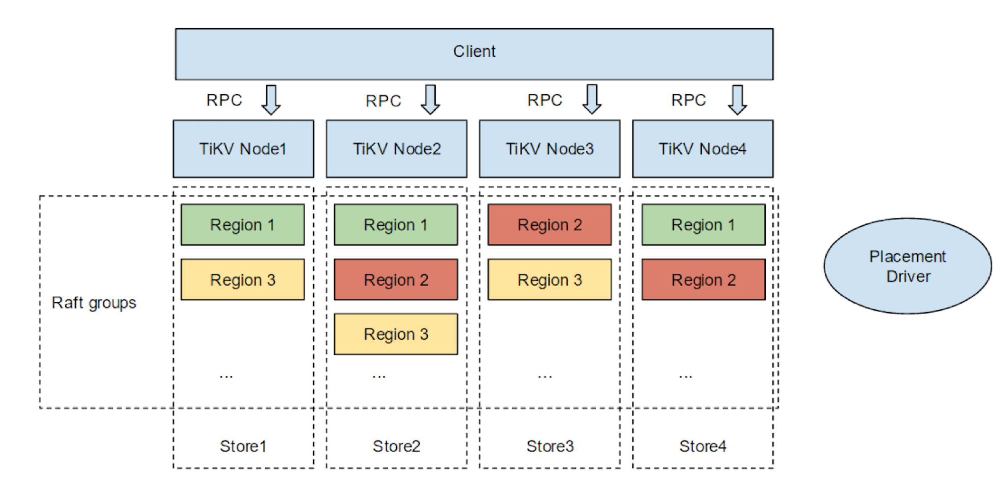
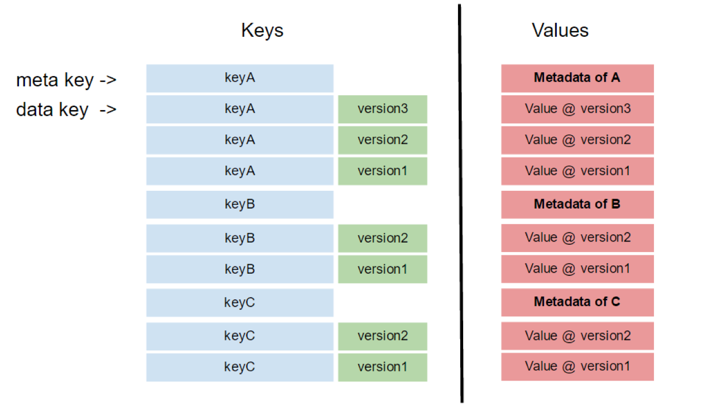
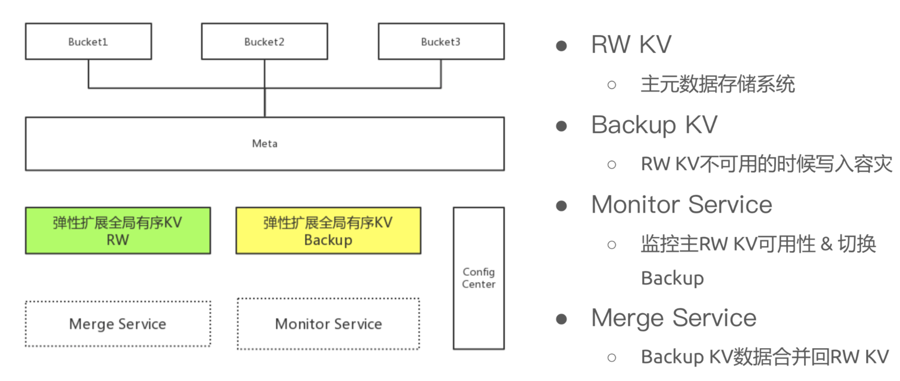
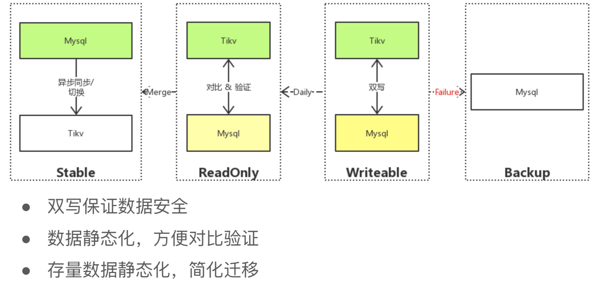

## 0 TiKV

Tikv支持无限的水平扩展，具备强一致性和高可用性。
当客户端发送一个请求给Tikv，Tikv首先解析协议，然后把请求分发给TiKv线程，TiKV线程执行一些事务逻辑并把请求发送给Raft线程，在Tikv复制Raft Log并应用到RocksDB之后，整个写请求结束.


Tikv优势在于：

- 异地复制：使用Raft和Placement Driver进行异地复制来保证数据的安全性。
- 水平扩展：直接增加节点即可实现系统扩容
- 一致性分布式事务：使用基于Google Percolator、优化后的两阶段提交协议来支持分布式事务。可以使用“begin”来开启事务，再使用“commit”提交事务或者“rollback”来回滚事务。
- 分布式计算的协处理器：跟HBase一样，支持协处理器框架来让用户直接在Tikv中做计算。
- 与TiDB深度融合：使用TiKV作为TiDB的后端存储引擎，提供分布式关系型数据库

## 1 RocksDB

Tikv底层使用Facebook开源的RocksDB，高性能的持久化Key-Value存储，可以实现现在在服务器负载下快速存储(特别是闪存存储）的数据存储的全部潜力。包括任意大小的字节流，支持原子读写。

RocksDB借用开源LevelDB的核心代码。可以调整为各种生产环境包括纯内存，闪存，硬盘或HDFS上运行。支持各种压缩算法，并且有生产和调试环境的各种工具。

RocksDB的主要设计点是为了充分利用Flash或RAM提供的高速读/写速率的全部潜力。它是一个嵌入式kv存储，key和value是任意字节流。RocksDB按顺序组织所有数据，常用操作是Get(key), Put(key), Delete(key)和Scan(key).


memtable 是一个内存数据结构，新写入的数据被插入到 memtable 中，并可选地写入日志文件
日志文件是存储上顺序写入的文件。当 memtable 填满时，它被 flush 到存储上的 sstfile ，然后可以被安全地删除。sstfile 中的数据顺序存放，以方便按 key 进行查找

RocksDB 使用 LRU 缓存来提供读取。块高速缓存被分割成两个单独的高速缓存：第一高速缓存是未压缩块，第二高速缓存是压缩块，它们都存在 RAM 中。如果配置了压缩块高速缓存，则数据库智能地避免在 OS buffer 中缓存数据。

RocksDB 的写入来说，通常不会每次写入一个值，而是会用一个 WriteBatch 缓存一批修改，然后再整个写入。

## 2 Multi-Raft Groups

Tikv使用Raft算法来实现异地复制数据。Tikv被设计来存储海量数据， 一个Raft远远不够。所以按照范围切分，然后把每个范围的数据作为一个独立的Raft Group。然后把这个方式命名为Multi-Raft Groups。


一般会有多个Tikv节点，在每一个节点存储中，有多个Region。Region是数据迁移和Raft复制的基本单位。每一个Region会被复制到三个节点中去。一个Region的三个副本成了一个Raft Group。

数据按照Key切分成很多Region，每个Region的数据只会保存在一个节点上。  Tikv系统会有一个组件来负责将Region尽可能均匀的散布在集群的所有的节点上，一方面实现了存储容量的水平扩展（新增节点，会自动将其他节点中的Region调度过来），另一方面也实现了负载均衡（不会出现某个节点有很多数据，而其他节点没有什么数据的情况）。同时为了保证上次客户端能够访问所需要的数据。由TiKV driver来将上层语句映射到正确的节点。

Tikv是以Region为单位做数据的复制，也就是一个Region会保存到多个副本，并把每一个副本叫做Replica。Replica之间通过Raft来保持数据一致性。一个Region的多个Replica会保存在不同的节点上，构成一个Raft Group。其中一个Replica会作为这个Group的Leader，其他的Replica作为Follower。所有的读和写都是通过Leader进行，再由Leader复制给Follower。


Region扩张时如果存在Leader的问题，可以像这个例子一样解决：节点A中三个Region，其他节点两个Region。为了缓解节点A的压力，将节点A中的Region 1 转移到新建节点E。但此时由于Region1的leader在节点A中，所以会先把Leader节点从节点A转到节点B。 之后在节点E中增加一个Region 1的副本。再从节点A中移除Region 1的副本。所有这一切都被Placement Driver自动执行的。唯一要做的就是发现系统繁忙时就添加节点。


Raft优化有：

初始Raft:
 - Leader 收到 client 发送的 request。
 - Leader 将 request append 到自己的 log。
 - Leader 将对应的 log entry 发送给其他的 follower。
 - Leader 等待 follower 的结果，如果大多数节点提交了这个 log，则 apply。
 - Leader 将结果返回给 client。
 - Leader 继续处理下一次 request。


 利用异步apply改进Raft:
- Leader 接受一个 client 发送的 request。
- Leader 将对应的 log 发送给其他 follower 并本地 append。
- Leader 继续接受其他 client 的 requests，持续进行步骤 2。
- Leader 发现 log 已经被 committed，在另一个线程 apply。
- Leader 异步 apply log 之后，返回结果给对应的 client

## 3 Placement Driver

Placement Driver监控的数据有：
- 总磁盘容量
- 可用磁盘容量
- 承载的 Region 数量
- 数据写入速度
- 发送/接受的 Snapshot 数量(Replica 之间可能会通过 Snapshot 同步数据)
- 是否过载
- 标签信息
- 标签是具备层级关系的一系列 Tag





Placement Driver是整个系统中的一个节点，它会时刻知道现在整个系统的状态。比如说每个机器的负载，每个机器的容量，是否有新加的机器，新加机器的容量到底是怎么样的，是不是可以把一部分数据挪过去，是不是也是一样下线， 如果一个节点在十分钟之内无法被其他节点探测到，认为它已经挂了，不管它实际上是不是真的挂了，但也认为它挂了。因为这个时候是有风险的，如果这个机器万一真的挂了，意味着现在机器的副本数只有两个，有一部分数据的副本数只有两个。那么现在必须马上要在系统里面重新选一台机器出来，它上面有足够的空间，现在只有两个副本的数据重新再做一份新的复制，系统始终维持在三个副本。整个系统里面如果机器挂掉了，副本数少了，这个时候应该会被自动发现，马上补充新的副本，这样会维持整个系统的副本数。这是很重要的 ，为了避免数据丢失，必须维持足够的副本数，因为副本数每少一个，风险就会再增加。这就是Placement Driver做的事情。

同时，Placement Driver 还会根据性能负载，不断去move这个data 。比如说负载已经很高了，一个磁盘假设有 100G，现在已经用了 80G，另外一个机器上也是 100G，但是只用了 20G，所以这上面还可以有几十 G 的数据，比如 40G 的数据，可以 move 过去，这样可以保证系统有很好的负载，不会出现一个磁盘巨忙无比，数据已经多的装不下了，另外一个上面还没有东西，这是 Placement Driver 要做的东西。

## 4 Multiversion concurrency control(MVCC)


MVCC指的是多版本并发控制，并发访问（读或者写）数据库时，对正在事务内处理的数据做多版本的管理，用来避免由于写操作的堵塞，而引发读操作失败的并发问题。



设想这样的场景，两个 Client 同时去修改一个 Key 的 Value，如果没有 MVCC，就需要对数据上锁，在分布式场景下，可能会带来性能以及死锁问题。 TiKV 的 MVCC 实现是通过在 Key 后面添加 Version 来实现，简单来说，没有 MVCC 之前，可以把 TiKV 看做这样的:


```c++
    Key1 -> Value
    Key2 -> Value
    ……
    KeyN -> Value
```

有了 MVCC 之后，TiKV 的 Key 排列是这样的：


```c++
	Key1-Version3 -> Value
	Key1-Version2 -> Value
	Key1-Version1 -> Value
	……
	Key2-Version4 -> Value
	Key2-Version3 -> Value
	Key2-Version2 -> Value
	Key2-Version1 -> Value
	……
	KeyN-Version2 -> Value
	KeyN-Version1 -> Value
	……
```
对于同一个 Key 的多个版本，我们把版本号较大的放在前面，版本号小的放在后面，这样当用户通过一个 Key + Version 来获取 Value 的时候，可以将 Key 和 Version 构造出 MVCC 的 Key，也就是 Key-Version。然后可以直接 Seek(Key-Version)，定位到第一个大于等于这个 Key-Version 的位置。

## 5 事务

TiKV 的事务采用的是 Percolator 模型，并且做了大量的优化。TiKV 的事务采用乐观锁，事务的执行过程中，不会检测写写冲突，只有在提交过程中，才会做冲突检测，冲突的双方中比较早完成提交的会写入成功，另一方会尝试重新执行整个事务。

当业务的写入冲突不严重的情况下，这种模型性能会很好，比如随机更新表中某一行的数据，并且表很大。但是如果业务的写入冲突严重，性能就会很差，举一个极端的例子，就是计数器，多个客户端同时修改少量行，导致冲突严重的，造成大量的无效重试。

## 6 京东云基于 TiKV 的元数据管理系统

如果要做千亿级的对象存储的元数据管理，那么需要将元数据的一个树状结构变成一个KV平坦结构。

做一个全局有序 KV，并且需要“足够大”，能够弹性扩张。这样系统架构就会变得非常简单。




京东云前期调研了很多产品，最终选择 TiKV 主要原因有以下四点：

- 全局有序 KV，可轻松⽔平扩展，功能上完全能够满⾜对象存储元数据管理的需求。

- 经过一些测试，性能上很好，能够满足要求。

- 社区活跃，文档和工具相对比较完善。这一点也很重要，TiKV 目前已经是 CNCF（云原生计算基金会）的孵化项目，很多功能可以快速开发，产品迭代也很迅速。

- 相对于 TiDB Server 而言，TiKV 的代码更加简单，而且我们后续可以在 TiKV 的基础上做更多开发工作。

基于Tikv，实现了如下的元数据管理系统：


直接将 MySQL 迁移到 TiDB 上，这个迁移过程已经非常成熟，但是由于迁移到 TiKV 前人的经验比较少，所以我们在迁移过程中也做了很多探索性的工作。

迁移方案如下：



上图是京东设计的迁移方案，首先线上的数据都必须双写，保证数据安全。第二，我们将存量数据设置为只读之后迁移到 TiKV 中，同时迁移过程中的增量数据直接写入TiKV，每天将前一日的增量数据做静态化处理，然后与MySQL 中的数据对比，验证数据正确性。另外，如果双写失败，会启用MySQL backup。


针对我们自己的业务，更多的会用存量数据静态化，而京东在存量数据静态化上，有如下的尝试：

在存量数据切换方面，京东首先将存量数据静态化，简化迁移、数据对比、回滚的流程；在增量数据切换方面，首先将增量数据双写 TiKV & MySQL，并且保证出现异常情况时快速回滚至 MySQL，不影响线上的业务。值得一提的是，由于 TiKV 在测试环境下的验证结果非常好，所以京东采用 TiKV 作为双写的 Primary。

整个切换 过程分为三个步骤：

- 存量数据切换到 TiKV，验证读。

- 增量数据切换到 TiKV，验证读写。

- 验证 TiKV 中的数据正确性之后，就下线 MySQL。

在验证上，京东做了如下图的双写验证：


目前 TiKV 在京东云对象存储业务上是 Primary 数据库，计划 2019 年年底会把原数据库下线。总共部署的集群数量为 10+，生产环境单集群 QPS 峰值 4 万（读写 1:1），最大的单集群数据量 200+亿，共有 50 余万个 Region，京东元数据管理业务对 Latency 要求比较高，目前 Latency 能保证在 10ms 左右。另外，京东云正在测试 TiKV 3.0，预计 2019 年第四季度能够上线。

## 7 TiDB在美团点评的实践

对于 TiDB 的定位，前期在于重点解决 MySQL 的单机性能和容量无法线性和灵活扩展的问题。

TiDB满足以下所有的技术要求：
- 协议兼容 MySQL：这个是必要项
- 大数据量，可以存储至少数十TB级别的数据。
- 高性能，在满足高 QPS 的同时，保证比较低的延时。
- 高可靠，数据被可靠的持久化存储，少量机器的损坏不会导致数据的丢失。
- 高可用，作为在线服务的底层依赖存储，要有非常完善的高可用性能力，外卖服务不同于电子商务，对实时性要求非常高，对系统的可用性的要求则是更高的。
- 易运维，可以在不停服的基础上进行数据迁移，和集群扩容。

主要用于写入量大、读 QPS 高的离线业务。

业务场景：

- 稳定的写入，每个事务操作 100~200 行不等，每秒 6w 的数据写入。
- 每天的写入量超过 500G，以后会逐步提量到每天 3T。
每 15 分钟的定时读 job，5000 QPS（高频量小）。
- 不定时的查询（低频量大）。
- 之前使用 MySQL 作为存储，但 MySQL 到达了容量和性能瓶颈，而业务的容量未来会 10 倍的增长

在真实数据场景下，非常稳定，高频低频两种查询也都满足需求，定向优化后 TiDB 的 SQL性能 比 MySQL 性能提高四倍。

## 8 三节点tikv集群性能小测

 在一个三节点的tikv集群中，使用相关profiling工具研究tikv可能的性能瓶颈，主要用于测试raw kv insert性能。在三节点的tikv集群上，线程数有194个，远远超过逻辑CPU个数48个。这个线程数是否能够平衡上下文切换与lock connection带来的负面影响，需要考虑。gRPC和transport stats是CPU资源占有资源最多的。

gRPC延时在23ms，总共200G，每个tikv实例承担了65G，